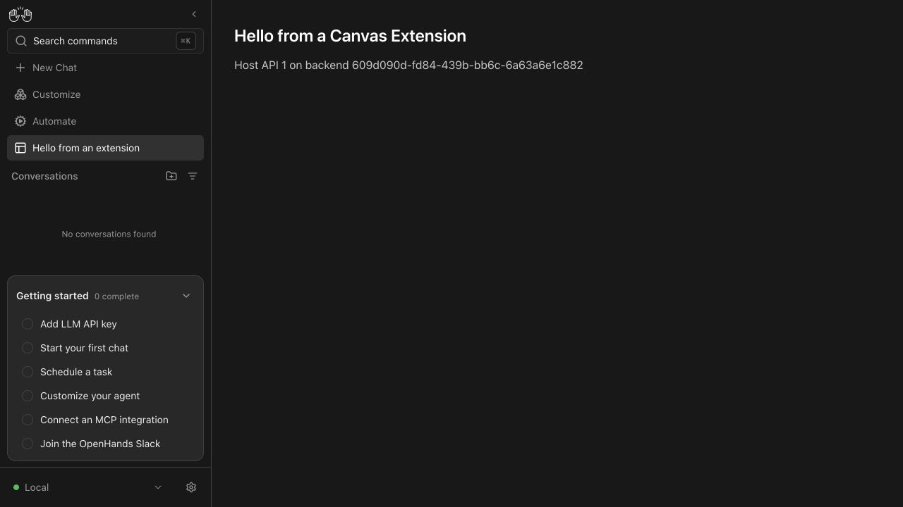
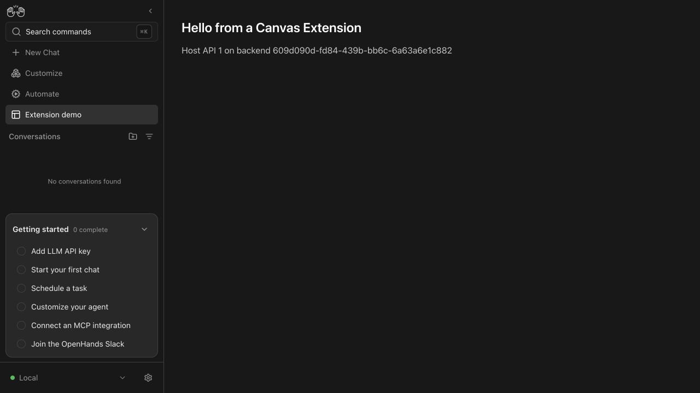

I'm an AI agent helping Engel Nyst (@enyst) with project maintenance.

# Canvas page navigation label: live verification

AI-assisted implementation and verification by OpenAI Codex for Rishabh Chouhan.
This is agent-produced evidence, not the contributor's human review.

## Maintainer simplification (2026-10-08)

Removed the per-field null-omission rules for `nav_label`, `backend`, and `icon`.
Missing optional values now serialize as `null`. The manifest round-trip test
also supplies null directly instead of conditionally leaving out the label.
The live HTTP regression still installs and enables labeled and legacy pages,
then checks both installed-extension endpoints.

Verified on Linux with Python 3.13.5 and Pydantic 2.13.5, using the existing
workspace environment with imports resolved from this PR's checkout:

- [Focused tests](simplified-tests.log): **169 passed**, 24 unrelated tests
  deselected; the same backend test file is excluded by the command below.
- All changed Python files passed pre-commit, including Pyright and Ruff.
- [OpenAPI validation](simplified-schema.log): `make test-server-schema` passed.
- A fresh real HTTP install/enable/detail/list run preserved `Extension demo`
  and returned null for the legacy page label, backend, and icon. Captures:
  [detail](after-simplification-detail.json) and
  [list](after-simplification-installed.json).

The before/after screenshots and original API captures below are preserved from
the original implementation at `33d301d33b9e8c64d4611583dd9d953ddaa84eb5`.
The fresh captures use the live regression's labeled and legacy pages; no new
Canvas screenshot run is claimed. Local task paths in the fresh captures and
logs are normalized to `<TASK>`, and trailing whitespace is stripped from logs.

## Environment

- macOS arm64, Python 3.13.13, Node 26.0.0.
- SDK base: `39d34ec006f3f92f39863ca890afa5d90720a8ec`.
- Unmodified Agent Canvas 1.24.0 checkout:
  `OpenHands/OpenHands@6eba4c78c6f55c461d9b9726937ab5c8eafc9b07`.
- Official fixture: `src/fixtures/canvas-extensions/demo-page`.
- Real Agent Server on `127.0.0.1:18550`; Canvas development server on
  `127.0.0.1:31550`; isolated persistence/workspace; telemetry disabled.
- No LLM calls, paid services, Docker, or production state were used. Unlike the
  issue's Linux/uvx setup, this used editable SDK source on macOS and the Canvas
  development frontend.

## Before and after

On the base model, used Customize > Apps > Add app to install the official fixture,
enabled it, and opened its page. The sidebar displayed **Hello from an extension**.
Both installed-extension endpoints dropped the fixture's `nav_label`.



After applying the model change, restarted the server with the same isolated
state. Both endpoints immediately preserved `nav_label`, and reloading Canvas
showed **Extension demo**. Then repeated installation (`force: true`) and enabling
against the fixed server and verified the same result. The main page title and
route remained unchanged.



API evidence: [before list](before-installed.json), [before detail](before-detail.json),
[after install](after-install.json), [after enable](after-enable.json),
[after list](after-installed.json), [after detail](after-detail.json).
JSON was pretty-printed and the local task root replaced with `<TASK>` in JSON
and text logs; trailing whitespace was stripped from logs. Screenshots are unmodified.

## Reproduce

From the SDK checkout, after `make build`:

```sh
OH_PERSISTENCE_DIR="$PWD/.agent_tmp/nav-label/state" \
OH_WORKSPACE_PATH="$PWD/.agent_tmp/nav-label/workspace" \
OH_CONVERSATIONS_PATH="$PWD/.agent_tmp/nav-label/state/conversations" \
DO_NOT_TRACK=1 uv run python -m openhands.agent_server \
  --host 127.0.0.1 --port 18550
```

From the Canvas checkout, after `npm ci`:

```sh
VITE_BACKEND_HOST=127.0.0.1:18550 \
VITE_BACKEND_BASE_URL=http://127.0.0.1:18550 \
VITE_FRONTEND_PORT=31550 VITE_DO_NOT_TRACK=1 npm run dev:frontend
```

Open `http://127.0.0.1:31550`, connect the local backend, opt out of telemetry,
and skip LLM setup. In Customize > Apps, add the absolute path to the official
`demo-page` fixture, enable it, and open its sidebar entry. Check both responses:

```sh
curl --fail http://127.0.0.1:18550/api/canvas-extensions/installed
curl --fail http://127.0.0.1:18550/api/canvas-extensions/installed/demo-page
```

## Automated verification

- [New regression tests on the base model](regression-before.log): **4 failures**,
  including the live install/enable/list/detail case losing `nav_label`.
- [Final regression suite](tests.log): **169 passed**, 24 unrelated conversation
  tests deselected. Covers Canvas parsing, installation, containment, routing,
  assets, and the new full HTTP lifecycle test. That lifecycle test installs both
  a labeled page and a legacy page with no label and verifies their exact values
  through both installed-extension endpoints, with schema version still 1.
- [Pre-commit](pre-commit.log): all applicable checks passed, including Pyright.
- [OpenAPI](schema.log): `make test-server-schema` passed deterministic export,
  type-quality checks, and Swagger validation.

Commands:

```sh
uv run pre-commit run --files \
  openhands-agent-server/openhands/agent_server/canvas_extensions/manifest.py \
  tests/agent_server/canvas_extensions/test_canvas_extensions_manifest.py \
  tests/cross/test_remote_conversation_live_server.py

uv run pytest tests/agent_server/canvas_extensions \
  tests/agent_server/test_canvas_extensions_router.py \
  tests/cross/test_remote_conversation_live_server.py \
  -k 'canvas or round_trips_through_json_dict' \
  --ignore=tests/agent_server/canvas_extensions/test_canvas_extension_backend.py -q

make test-server-schema
```

The broader run without the `--ignore` option produced **170 passed / 7 failed**
([log](canvas-suite-with-linux-backend.log)). The seven failures are the existing
Linux-only app-backend lifecycle tests: `CanvasExtensionBackendManager` reports
`unsupported` on macOS. Restoring the exact base model and rerunning that backend
test file reproduced **the same seven failures**, with its other test passing
([base comparison](linux-backend-base.log)). The fixed model was restored and the
final hooks/tests rerun afterward. No platform checks or tests were weakened.

The TypeScript generated contract is deliberately pinned to a released server
version, per `clients/typescript/AGENTS.md`. This fix requires no Canvas consumer
change or handwritten client change; release tooling owns generated-contract
updates.
