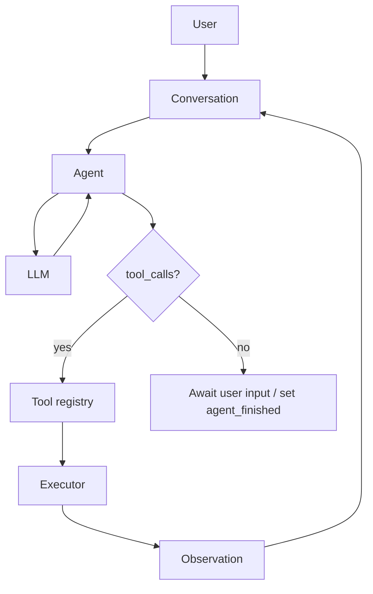
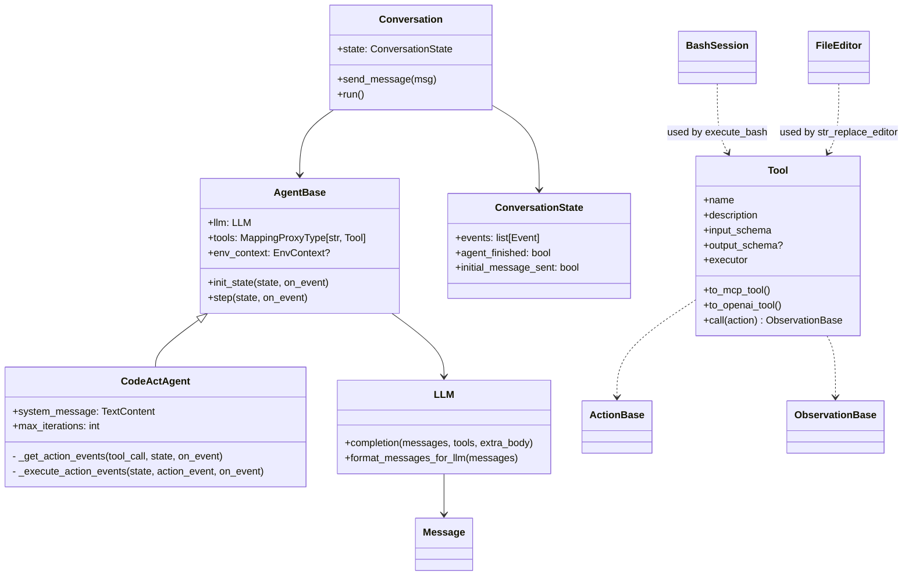

# Architecture Overview: OpenHands Agent SDK

This document provides a high-level map of the Agent SDK architecture for contributors. It complements docstrings and tests with visual diagrams and direct file pointers.

- Two packages with clear boundaries:
  - openhands/core: agent orchestration, conversation lifecycle, LLM integration, context, tool abstractions, event types/visualization
  - openhands/tools: concrete tool implementations (execute_bash, str_replace_editor) and tool utilities
- Integration tests at repo root exercise both packages together

## Flow (LLM <-> Agent <-> Tools)



## Key classes and relationships (simplified)



Notes:
- Events (openhands/core/event) are the lingua franca between components: MessageEvent, ActionEvent, ObservationEvent, SystemPromptEvent, AgentErrorEvent. Conversation composes callbacks (visualizer + user callbacks + state persistence) and persists all events.
- Built-in tools live in openhands/core/tool/builtins. FinishTool is always present and terminates the conversation gracefully.

## Subsystem overview

- Agents and Conversation
  - Conversation composes callbacks (visualizer + optional user callbacks) and manages a ConversationState with an internal lock for thread-safe mutation.
  - AgentBase defines the interface; CodeActAgent handles system prompt injection, env context rendering for the first user message, the LLM tool-call loop, and FinishTool termination.
  - State is mutated in-place by Agent.init_state/step (contract enforced by design, with TODOs to add explicit tests for in-place mutation and concurrent send_message during run).

- LLM integration (openhands/core/llm/llm.py)
  - Thin wrapper over LiteLLM providing retries, metrics (latency, token usage, cost), model feature detection via utils/model_features, prompt caching flags, and provider quirks gating (e.g., DeepSeek/Gemini/Anthropic toggles).
  - format_messages_for_llm serializes Message and toggles capabilities per model features. Cost tracking uses litellm completion cost with multiple fallbacks.

- Tool system (openhands/core/tool)
  - Tool wraps schemas (ActionBase/ObservationBase) and an executor. Accepts JSON schema or Pydantic subclasses; exports to both MCP and OpenAI tool formats.
  - Tool.call validates, executes, and coerces outputs to ObservationBase; output schema is optional and enforced only when provided.
  - Built-in tools include FinishTool (core); environment-interacting tools live in openhands/tools.

- Tools package (openhands/tools)
  - execute_bash: tmux-backed BashSession with robust prompt-marking, history management, cwd tracking, timeouts (no-change vs hard), and controlled input to running processes.
  - str_replace_editor: FileEditor supporting view/create/str_replace/insert/undo with strict path validation (absolute paths), encoding handling, edit history and undo, and safe string replacement semantics.

## Key data structures

- Message: LLM-facing message with optional tool_calls; serializer supports function calling and prompt-caching/vision flags.
- ConversationState: Conversation lifecycle flags and event history with a re-entrant lock; used as the single source of truth shared by agent and conversation.
- Tool registry: MappingProxyType[str, Tool] for immutability and O(1) lookup by tool name.
- ActionBase/ObservationBase: Pydantic models/Schemas that define tool IO contracts. Schema conversion to MCP JSON is supported; dynamic models can be synthesized from JSON schemas.

## Linus-style quick review (risk/quality)

Core Judgment: Worth doing — clean separation (agent/conversation/llm/tool/event), immutable tool registry, and strong IO typing reduce footguns while staying pragmatic.

Key Insights
- Data Structure: ConversationState is the nucleus; agents and tools only mutate this shared state. Tool registry is immutable to avoid accidental clashes.
- Complexity: Provider-specific LLM quirks are centralized via model_features and mapping helpers; a few special cases remain but are contained.
- Risk: Changing tool names or schemas breaks existing prompts/conversations. Mixing streaming in LLM is intentionally avoided — keep it that way unless callbacks/state are redesigned.

Taste Rating: Good taste

Critical Issue: None blocking. Add tests for CodeActAgent.init_state in-place mutation (there’s a TODO) and for Conversation.run iteration limit behavior with concurrent send_message.

Improvement Direction
- Eliminate scattered provider conditionals by keeping them only in features/mapping helpers (already mostly done).
- Strengthen tests around tool arg validation errors and unknown tool handling paths.
- Document BashSession lifecycle and C-l/clear-history behavior for maintainers (this doc adds pointers).

## How to run locally

```bash
make build
uv run python examples/hello_world.py
uv run pytest
uv run pre-commit run --all-files
```

## File pointers (non-exhaustive)

- openhands/core/agent/base.py, agent/codeact_agent/codeact_agent.py
- openhands/core/conversation/conversation.py, conversation/state.py, conversation/visualizer.py
- openhands/core/llm/llm.py, llm/utils/model_features.py
- openhands/core/tool/tool.py, tool/schema.py, tool/builtins/finish.py
- openhands/core/event/*
- openhands/tools/execute_bash/*, openhands/tools/str_replace_editor/*

If you want a deeper dive (e.g., sequence diagram per step or error paths), open an issue with the exact scenario and we’ll extend this document with targeted diagrams.
