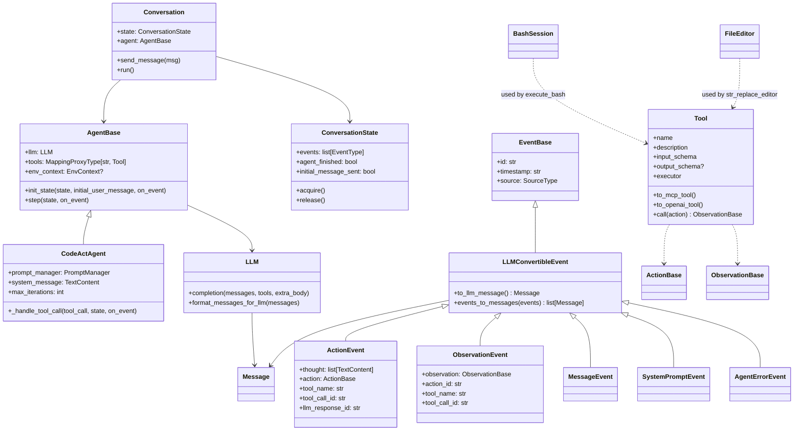
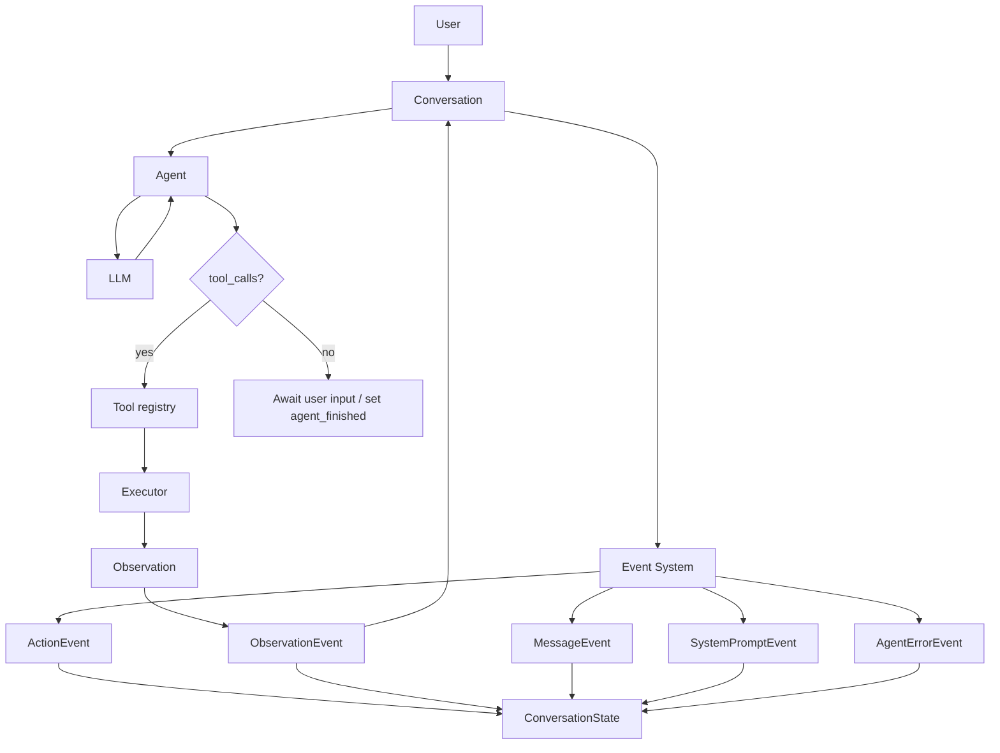

# Architecture Overview: OpenHands Agent SDK

This document provides a comprehensive overview of the OpenHands Agent SDK architecture, including class relationships, data flow, and key subsystems.

## Summary

The OpenHands Agent SDK is structured as two main packages with clear boundaries:

- **`openhands/core`**: Agent orchestration, conversation management, LLM integration, context handling, event system, and tool abstractions
- **`openhands/tools`**: Concrete tool implementations (`execute_bash`, `str_replace_editor`) and tool utilities

Integration tests at the repository root exercise both packages together to ensure end-to-end functionality.

## Key Classes and Relationships



## System Flow



## Subsystem Details

### Agents and Conversation

- **Conversation** composes callbacks (visualizer + optional user callbacks) and manages a `ConversationState`
- **AgentBase** defines the interface; **CodeActAgent** handles system prompt, environment context injection, LLM tool-call loop, and FinishTool termination
- **ConversationState** maintains thread-safe event history and conversation lifecycle flags using RLock
- State is mutated in-place by `Agent.init_state`/`step` (contract enforced by design and tests)

### Event System

The event system provides structured tracking of all conversation activities:

- **EventBase**: Base class for all events with ID, timestamp, and source tracking
- **LLMConvertibleEvent**: Events that can be converted to LLM messages for conversation history
- **Event Types**:
  - `ActionEvent`: Agent actions (tool calls) with thought process and LLM response grouping
  - `ObservationEvent`: Tool execution results from the environment
  - `MessageEvent`: User or agent messages with optional microagent activation tracking
  - `SystemPromptEvent`: System prompts with available tools
  - `AgentErrorEvent`: Error messages from the agent scaffold

Events support batching for parallel function calling scenarios and provide rich string representations for debugging.

### LLM Integration

Located in `openhands/core/llm/llm.py`:

- Thin wrapper over LiteLLM providing retries, metrics (latency, token usage, cost), model feature detection, prompt caching, vision/tool-calling toggles, and provider quirks
- `format_messages_for_llm` serializes Message objects while toggling capabilities per model features
- Centralized handling of provider-specific requirements (e.g., Gemini/Anthropic mappings)

### Tool System

Located in `openhands/core/tool`:

- **Tool** wraps schemas (`ActionBase`/`ObservationBase`) and an executor
- Accepts JSON schema or Pydantic subclasses; exports to both MCP and OpenAI tool formats
- `Tool.call` validates input, executes, and coerces outputs to `ObservationBase`
- Built-in tools include `FinishTool` for conversation termination
- Tool registry uses `MappingProxyType[str, Tool]` for immutability and O(1) lookup

### Tools Package

Located in `openhands/tools`:

- **execute_bash**: tmux-backed `BashSession` with robust prompt-marking, timeouts (no-change vs hard), and controlled input to running processes
- **str_replace_editor**: `FileEditor` supporting view/create/str_replace/insert/undo with strict path validation (absolute paths), encoding handling, history, and safe edits

## Key Data Structures

- **Message**: LLM-facing message with optional tool_calls; serializer supports function calling and prompt-caching/vision flags
- **ConversationState**: Thread-safe conversation lifecycle flags and event history; single source of truth for conversation state
- **Tool registry**: `MappingProxyType[str, Tool]` for immutability and O(1) lookup by tool name
- **ActionBase/ObservationBase**: Pydantic models that define tool IO contracts
- **Event hierarchy**: Structured event tracking with LLM message conversion capabilities

## Linus-style Architecture Review

### Core Judgment
✅ **Worth doing** — Clean separation (agent/conversation/llm/tool/event), immutable tool registry, thread-safe state management, and strong IO typing reduce footguns while staying pragmatic.

### Key Insights
- **Data Structure**: `ConversationState` with event list is the nucleus; agents and tools only mutate this shared state. Tool registry is immutable to avoid accidental clashes.
- **Complexity**: Provider-specific LLM quirks are centralized via `get_features`; event system eliminates special cases for conversation history management.
- **Risk**: Changing tool names or schemas breaks existing prompts/conversations. Thread safety is properly handled with RLock.

### Taste Rating
🟢 **Good taste** — Event system eliminates special cases for conversation tracking, thread-safe state management, and clean separation of concerns.

### Critical Issues
None blocking. Recommendations:
- Add tests for `CodeActAgent.init_state` in-place mutation (there's a TODO)
- Test `Conversation.run` iteration limit behavior with concurrent `send_message`
- Document `BashSession` lifecycle and C-l/clear-history behavior for maintainers

### Improvement Direction
- Event system already eliminates scattered conversation state management
- Strengthen tests around tool arg validation errors and unknown tool handling paths
- Provider conditionals are well-contained in LLM feature detection

## How to Run Locally

```bash
# Setup development environment
make build

# Run example
uv run python examples/hello_world.py

# Run tests
uv run pytest

# Run pre-commit hooks
uv run pre-commit run --all-files
```

## File Pointers

### Core Components
- `openhands/core/agent/base.py`, `codeact_agent/codeact_agent.py`
- `openhands/core/conversation/conversation.py`, `state.py`
- `openhands/core/event/base.py`, `llm_convertible.py`, `types.py`
- `openhands/core/llm/llm.py`
- `openhands/core/tool/tool.py`, `schema.py`, `builtins/finish.py`

### Tool Implementations
- `openhands/tools/execute_bash/*`
- `openhands/tools/str_replace_editor/*`

### Tests and Examples
- `openhands/core/tests/` - Unit tests for core package
- `openhands/tools/tests/` - Unit tests for tools package  
- `tests/` - Integration tests
- `examples/hello_world.py` - Basic usage example

## Extension Points

For deeper architectural analysis or specific use cases:

- **Sequence diagrams**: Step-by-step execution flow through agent/tool interactions
- **Error handling paths**: Comprehensive error propagation and recovery mechanisms
- **Custom tool development**: Guidelines for implementing new tools with proper schema validation
- **Event system extensions**: Adding new event types or custom event processing

This architecture provides a solid foundation for building AI agents with proper separation of concerns, type safety, and extensibility.